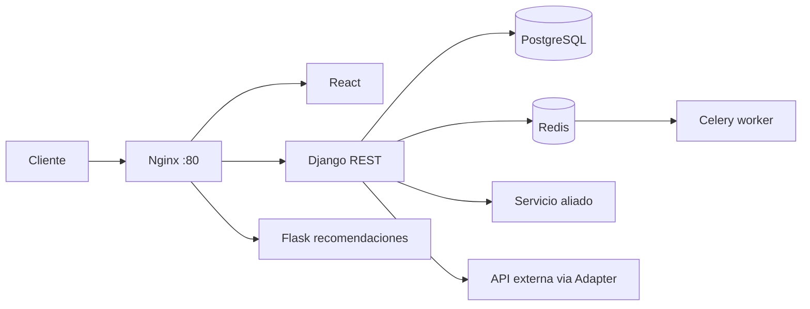

# PuntoTech

E-commerce de tecnologia con monolito Django, microservicio Flask de recomendaciones, frontend React, Nginx como gateway, PostgreSQL, Redis y Celery.

## Arquitectura

La arquitectura actualizada esta documentada en [docs/arquitectura.md](docs/arquitectura.md).



## Requisitos cubiertos

| Requisito | Evidencia |
|---|---|
| Monolito + microservicio | `backend/`, `recomendation_service/` |
| Strangler Pattern | Nginx enruta `/api/v2/recomendaciones/` a Flask y Django consume el microservicio |
| Docker Compose completo | `docker-compose.yml` incluye Django, Flask, Nginx, frontend, Postgres, Redis y Celery |
| Message broker / tareas de fondo | `redis` + `celery-worker` + `backend/api/tasks.py` |
| Base de datos orquestada | Servicio `db` con PostgreSQL |
| Servicio JSON propio | `GET /api/integracion/catalogo/` |
| Consumo de servicio aliado | `GET /api/integracion/aliado/catalogo/` usa `ALLIED_SERVICE_URL` |
| API de terceros con Adapter | `GET /api/integracion/tasa-cambio/?from=USD&to=COP` |
| i18n con gettext | `LocaleMiddleware`, `LANGUAGES`, `backend/locale/` |
| Frontend en despliegue | Nginx sirve React y el frontend usa `/api` |
| Correcciones Entrega 1 | `docs/correcciones_entrega_1.md` |

## Ejecucion con Docker

Crear un `.env` en la raiz a partir de `.env.example` o exportar variables equivalentes. Para desarrollo se pueden usar los defaults del compose.

```bash
docker compose up --build
```

Servicios:

| URL | Servicio |
|---|---|
| `http://localhost/` | Frontend React |
| `http://localhost/api/health/` | Django health |
| `http://localhost/flask/health` | Flask health |
| `http://localhost/api/integracion/catalogo/` | JSON para equipo aliado |
| `http://localhost/api/integracion/aliado/catalogo/` | Consumo del equipo aliado |
| `http://localhost/api/integracion/tasa-cambio/?from=USD&to=COP` | Adapter API externa |

## Variables importantes

| Variable | Descripcion |
|---|---|
| `ALLOWED_HOSTS` | Hosts permitidos, incluir IP elastica o dominio de AWS |
| `CSRF_TRUSTED_ORIGINS` | Origenes confiables para despliegue |
| `POSTGRES_DB`, `POSTGRES_USER`, `POSTGRES_PASSWORD` | Credenciales de PostgreSQL |
| `CELERY_BROKER_URL` | Broker Redis para Celery |
| `ALLIED_SERVICE_URL` | URL base del servicio JSON del equipo aliado |
| `EXTERNAL_RATE_API_URL` | API externa usada por el adapter |
| `LANGUAGE_CODE` | `es` o `en` |

## AWS Academy

Para produccion en EC2:

1. Reservar/asociar una IP elastica a la instancia.
2. Instalar Docker y Docker Compose.
3. Clonar el repo y crear `.env` con `DEBUG=False`, `ALLOWED_HOSTS=<IP_ELASTICA>` y `CSRF_TRUSTED_ORIGINS=http://<IP_ELASTICA>`.
4. Ejecutar `docker compose up --build -d`.
5. Anexar capturas de `http://<IP_ELASTICA>/`, `http://<IP_ELASTICA>/api/health/` y `docker compose ps`.

## Desarrollo local sin Docker

SQLite sigue disponible como fallback si `DB_ENGINE` no es `postgres`.

```bash
cd backend
pip install -r requirements.txt
python manage.py migrate
python manage.py runserver
```

Para que Celery ejecute tareas sin Redis durante pruebas locales:

```bash
set CELERY_TASK_ALWAYS_EAGER=True
```
