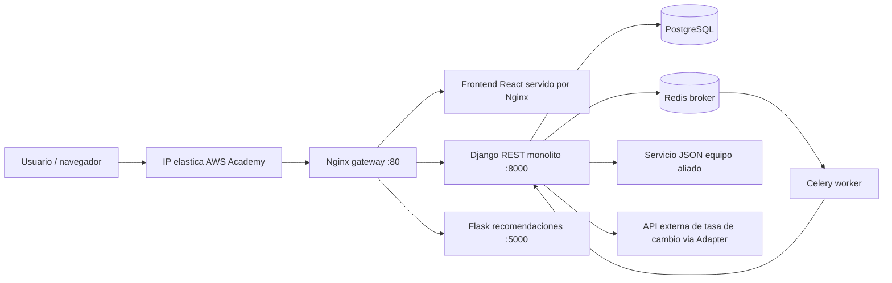

# Arquitectura Actualizada

## Rutas principales

| Ruta | Destino |
|---|---|
| `/` | Frontend React |
| `/api/` | Django REST |
| `/api/v2/recomendaciones/` | Microservicio Flask por Strangler Pattern |
| `/flask/health` | Health check Flask |
| `/static/` | Archivos estaticos de Django |

## Servicios Docker

| Servicio | Responsabilidad |
|---|---|
| `nginx` | Gateway publico |
| `frontend` | Build estatico de React |
| `django` | API principal |
| `flask-recomendaciones` | Microservicio extraido |
| `db` | PostgreSQL |
| `redis` | Message broker |
| `celery-worker` | Tareas asincronas de notificacion |
